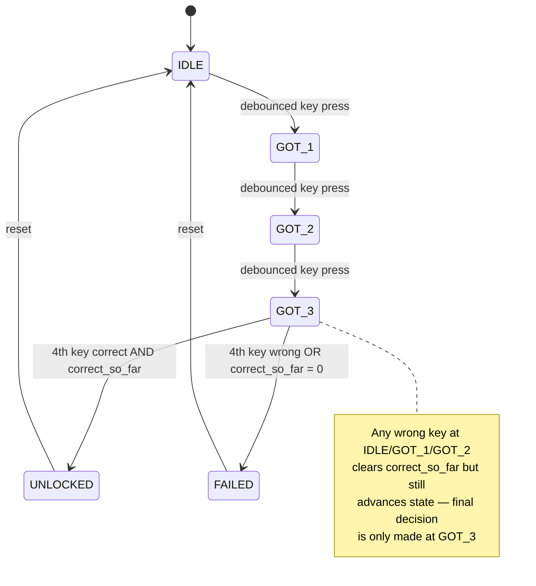
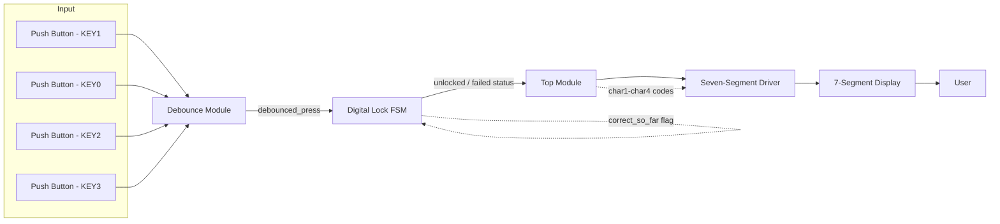

# 🔐 Digital Lock using FSM on FPGA (Spartan-7)

A synchronous, Moore-type Finite State Machine implementation of a 4-digit sequential combination lock in **Verilog HDL**, synthesized and deployed on a **Xilinx Spartan-7 FPGA**. Includes hardware switch debouncing and a flicker-free multiplexed 7-segment status display.

---

## 📌 Overview

Mechanical-key security systems suffer from switch bounce and asynchronous timing, which can corrupt sequential input validation. This project implements a **deterministic, hardware-level digital lock** that:

- Accepts a 4-key sequential combination via debounced mechanical inputs
- Validates the sequence using a synchronous 6-state Moore FSM
- Displays real-time status (`UnLc` for unlocked, `_Loc` for failed) on a multiplexed 7-segment display
- Remains fully deterministic and glitch-free by construction — no software, no microcontroller, pure synchronous logic

Unlike software-based locks, this design provides **hardware-guaranteed timing, noise immunity, and non-bypassable state transitions**, making the same architecture pattern directly applicable to access control, automotive security, and industrial interlock systems.

---

## 🧠 FSM Design

The lock is modeled as a **Moore machine** — outputs depend only on the current state — with 6 states tracking progress through the 4-key sequence.



| State | Encoding | Function |
|---|---|---|
| `IDLE` | `3'b000` | Waiting for first key press |
| `GOT_1` | `3'b001` | First key acknowledged |
| `GOT_2` | `3'b010` | Second key acknowledged |
| `GOT_3` | `3'b011` | Third key acknowledged — awaits final decision |
| `UNLOCKED` | `3'b100` | Correct 4-key sequence entered; holds until reset |
| `FAILED` | `3'b101` | Incorrect key at any step; holds until reset |

**Key design decision:** the FSM always advances through all 4 states even after an early wrong key, using a `correct_so_far` flag rather than failing immediately. This prevents timing side-channels that would otherwise leak *which* digit was wrong based on how quickly the system rejects the attempt.

---

## 🏛️ System Architecture



The design follows a clean hierarchical decomposition — `top_module` wires together three independently testable subsystems: input conditioning (`debounce`), core sequential logic (`digital_lock`), and output driving (`seven_segment_driver`).

---

## 🔧 Module Breakdown

| Module | Purpose | Key Inputs | Key Outputs |
|---|---|---|---|
| `debounce` | Filters mechanical switch noise; synchronizes async input across clock domains; outputs one clean pulse per press | `clk`, `reset`, `buttons_in[3:0]` | `debounced_press` |
| `digital_lock` | 6-state Moore FSM validating the 4-key sequence | `clk`, `reset`, `debounced_press`, `keys_in[3:0]` | `unlocked`, `failed` |
| `seven_segment_driver` | Time-division multiplexed 4-digit common-anode display driver | `clk`, `reset`, `char1`–`char4` | `segments_out[6:0]`, `anodes_out[3:0]` |
| `top_module` | Top-level wrapper; routes FSM status to display character codes | `clk`, `reset_sw`, `keys_in[3:0]` | `segments_out`, `anodes_out` |

### Implementation notes
- **Debounce**: raw button input passes through a 2-flip-flop synchronizer (metastability protection) before a 21-bit counter enforces a 20ms stable-press window (100MHz clock → 2,000,000 cycles).
- **FSM**: split into two `always` blocks — synchronous state register (`posedge clk`) and combinational next-state/output logic (`always @(*)`), following standard two-process FSM coding style.
- **Display**: 18-bit refresh counter drives ~122Hz digit multiplexing (well above flicker threshold); active-low segment/anode encoding for common-anode hardware.
- **Password sequence**: active-low key codes `KEY1 → KEY0 → KEY2 → KEY3`.

---

## 🚀 Getting Started

### Simulation (any Verilog simulator, e.g. Icarus Verilog / ModelSim)
```bash
iverilog -o sim_out rtl/*.v sim/testbench.v
vvp sim_out
```

### Synthesis onto Xilinx Spartan-7 (Vivado)
1. Create a new Vivado project targeting your Spartan-7 part.
2. Add all files under `rtl/` as design sources.
3. Add `constraints/spartan7.xdc` mapping `clk`, `reset_sw`, `keys_in`, `segments_out`, `anodes_out` to your board's pins.
4. Run Synthesis → Implementation → Generate Bitstream → Program Device.

---

## ✅ Verification

- Verified via behavioral simulation confirming correct state transitions for all valid and invalid key sequences.
- Debounce timing validated against a 20ms mechanical bounce window.
- Hardware-tested on Spartan-7 dev board: correct sequence lights `UnLc`, incorrect sequence lights `_Loc`.

| Correct sequence | Incorrect sequence |
|---|---|
|  |  |

---

## 🔭 Future Scope

- **Non-volatile code storage** — Flash/EEPROM-backed, user-programmable combination that survives power-off
- **Lockout timer** — auto-lock for a cooldown period (e.g. 30s) after repeated failed attempts
- **Acoustic feedback** — tone generator for key press / unlock / failure events

## 🏭 Applications

- Physical access control (server racks, vaults, keyless entry)
- Automotive security (immobilizers, keypad entry systems)
- Industrial interlocks requiring a correct startup sequence
- Consumer electronics (safes, vending machines)

---
