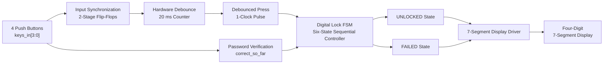
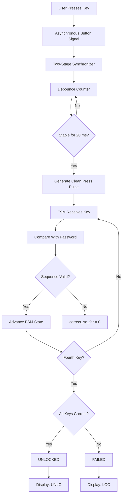
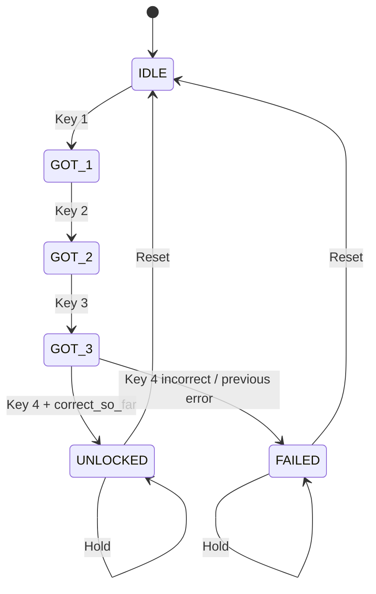
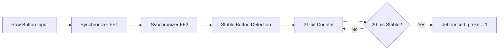
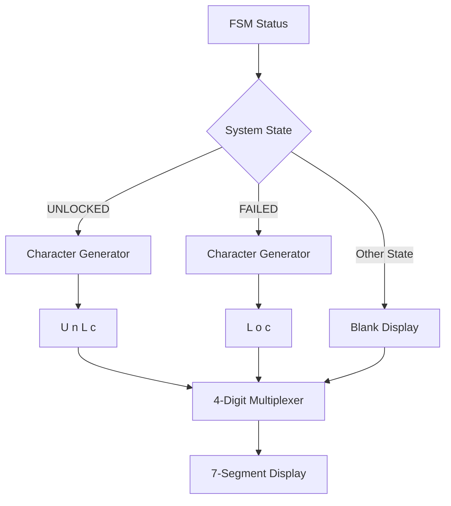
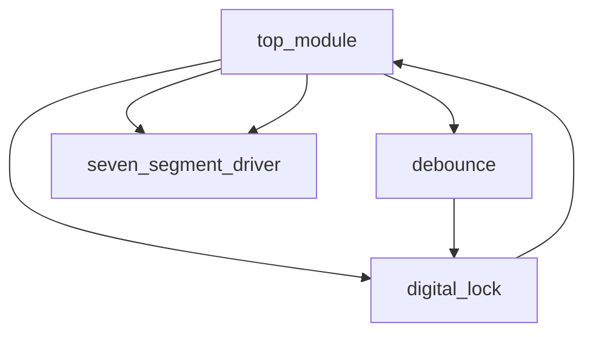
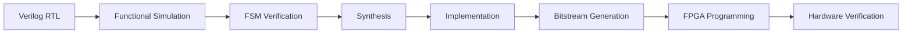

Absolutely. Based on your **actual VLSI project report**, I’d make the GitHub README recruiter-focused around **RTL/FPGA design, FSM, hardware debouncing, synchronization, and 7-segment multiplexing** rather than presenting it as a basic button project. The report specifies a four-key active-low sequence, six-state FSM, 20 ms debounce circuit, and multiplexed four-digit 7-segment driver. 

Below is the **complete final README**. You can **copy-paste the entire code directly into `README.md`**.

````markdown
# 🔐 FPGA-Based Digital Lock Using Finite State Machine

> **A hardware-based digital access-control system implemented in Verilog HDL using a synchronous six-state Finite State Machine (FSM), hardware push-button debouncing, input synchronization, and a multiplexed four-digit 7-segment display on a Xilinx Spartan-7 FPGA.**

---

## 📌 Project Overview

This project implements a **digital combination lock** using **Verilog HDL** and FPGA-based digital logic.

The system validates a predefined **four-key password sequence** using a synchronous **Finite State Machine (FSM)**. To make the design reliable on real hardware, asynchronous mechanical push-button inputs are synchronized and processed through a **counter-based hardware debounce circuit**.

The authentication result is displayed on a **four-digit multiplexed 7-segment display**:

```text
Successful Authentication → UNLC
Failed Authentication      → LOC
````

The complete design follows a modular RTL architecture consisting of:

```text
Push Buttons
     ↓
Input Synchronization
     ↓
Hardware Debouncing
     ↓
Digital Lock FSM
     ↓
Status Generation
     ↓
7-Segment Display Driver
```

The design was synthesized and implemented on a **Xilinx Spartan-7 FPGA**, demonstrating practical FPGA-based sequential logic and hardware security concepts.

---

## 🎯 Project Objectives

* Design a synchronous FSM for sequential password verification.
* Implement the digital lock using **Verilog HDL**.
* Process asynchronous mechanical push-button inputs reliably.
* Reduce switch-bounce effects using a hardware debounce circuit.
* Synchronize external button inputs with the FPGA clock.
* Implement deterministic password validation logic.
* Generate separate `UNLOCKED` and `FAILED` system states.
* Drive a multiplexed four-digit 7-segment display.
* Verify the design through simulation, synthesis, and FPGA hardware implementation.

---

# 🏗️ System Architecture



---

# 🔄 Complete Data Flow



---

# 🧠 Finite State Machine

The core of the system is a **six-state synchronous FSM**.

The FSM tracks the progress of the four-key authentication sequence and ultimately enters either the `UNLOCKED` or `FAILED` state.



---

## 🧩 FSM State Table

| State      | Binary Encoding | Function                          |
| ---------- | --------------: | --------------------------------- |
| `IDLE`     |        `3'b000` | Waits for the first key           |
| `GOT_1`    |        `3'b001` | First key received                |
| `GOT_2`    |        `3'b010` | Second key received               |
| `GOT_3`    |        `3'b011` | Third key received                |
| `UNLOCKED` |        `3'b100` | Correct four-key sequence entered |
| `FAILED`   |        `3'b101` | Incorrect password sequence       |

---

# 🔑 Password Sequence

The design uses **active-low key inputs**.

The predefined four-key sequence is:

```text
KEY1 → KEY0 → KEY2 → KEY3
```

The corresponding active-low patterns are:

```text
PASS_1 = 4'b1101
PASS_2 = 4'b1110
PASS_3 = 4'b1011
PASS_4 = 4'b0111
```

### Authentication Process

```text
IDLE
  │
  │ Correct Key 1
  ▼
GOT_1
  │
  │ Correct Key 2
  ▼
GOT_2
  │
  │ Correct Key 3
  ▼
GOT_3
  │
  │ Correct Key 4
  ▼
UNLOCKED
```

If an incorrect key is detected at any stage, the `correct_so_far` flag is cleared.

The final decision is made during the fourth key press.

---

# 🛡️ Hardware Button Debouncing

Mechanical push buttons do not produce a perfectly clean digital transition.

During a physical press, the signal may rapidly alternate between logic `0` and `1`. This phenomenon is known as **switch bounce**.

To prevent false FSM transitions, the project implements a dedicated hardware debounce circuit.



### Debounce Parameters

The design uses:

```text
FPGA Clock Frequency = 100 MHz
Clock Period         = 10 ns
Debounce Time        = 20 ms
Required Cycles      = 2,000,000
Counter Maximum      = 1,999,999
```

The debounce module uses two sequential synchronization flip-flops before the counter-based filtering stage to reduce metastability concerns when external asynchronous button signals enter the FPGA clock domain.

---

# ⏱️ Clock and Timing

The design operates using the FPGA system clock.

```text
Clock Frequency = 100 MHz
Clock Period    = 10 ns
```

The synchronous FSM changes state on the rising edge of the clock.

This provides:

* Deterministic state transitions
* Predictable timing
* Easier timing analysis
* Reliable interaction between hardware modules

---

# 🖥️ 7-Segment Display

A dedicated **multiplexed 7-segment display driver** provides real-time status feedback.



### Display Status

| System Condition             | Display |
| ---------------------------- | ------- |
| Successful authentication    | `UNLC`  |
| Failed authentication        | `LOC`   |
| Standby / intermediate state | Blank   |

The display driver uses time-division multiplexing to control the four display digits.

---

# 🔢 7-Segment Multiplexing

The design uses an **18-bit refresh counter**.

The upper two counter bits are used to cycle through the four display digits.

```text
100 MHz Clock
     ↓
18-bit Refresh Counter
     ↓
2-bit Digit Select
     ↓
Four Display Anodes
     ↓
Segment Decoder
     ↓
7-Segment Display
```

The resulting digit refresh is designed to provide a visually stable display without noticeable flickering.

---

# 🧱 Modular RTL Architecture

The project is divided into four main Verilog modules.



## Module Responsibilities

| Module                 | Responsibility                                          |
| ---------------------- | ------------------------------------------------------- |
| `top_module`           | Top-level integration of the complete design            |
| `digital_lock`         | Implements the six-state password-verification FSM      |
| `debounce`             | Synchronizes and filters mechanical button inputs       |
| `seven_segment_driver` | Multiplexes and drives the four-digit 7-segment display |

---

# 🔌 Module Interface

## `top_module`

```text
Inputs:
    clk
    reset_sw
    keys_in[3:0]

Outputs:
    segments_out[6:0]
    anodes_out[3:0]
```

## `digital_lock`

```text
Inputs:
    clk
    reset
    keys_in[3:0]
    debounced_press

Outputs:
    unlocked
    failed
```

## `debounce`

```text
Inputs:
    clk
    reset
    buttons_in[3:0]

Output:
    debounced_press
```

## `seven_segment_driver`

```text
Inputs:
    clk
    reset
    char1
    char2
    char3
    char4

Outputs:
    segments[6:0]
    anodes[3:0]
```

---

# ⚙️ Working Principle

## 1. Initialization

When the FPGA is powered on or reset is asserted:

```text
FSM → IDLE
correct_so_far → 1
Display → Blank
```

The system waits for the first key press.

---

## 2. Button Input

The four mechanical buttons provide the password input.

Because these signals originate outside the synchronous clock domain, they first pass through synchronization flip-flops.

---

## 3. Debouncing

The synchronized input is processed by a 20 ms debounce counter.

Only a stable button press produces:

```text
debounced_press = 1
```

for one clock cycle.

---

## 4. Password Verification

The FSM receives each valid key press and progresses through:

```text
IDLE
 ↓
GOT_1
 ↓
GOT_2
 ↓
GOT_3
```

The password is checked at each stage.

---

## 5. Correct Sequence

If all four keys are correct:

```text
GOT_3
  ↓
UNLOCKED
```

The display shows:

```text
UNLC
```

---

## 6. Incorrect Sequence

If any key is incorrect, the `correct_so_far` flag becomes `0`.

After the final key:

```text
GOT_3
  ↓
FAILED
```

The display shows:

```text
LOC
```

---

## 7. Reset

The `UNLOCKED` and `FAILED` states remain active until reset is asserted.

After reset:

```text
UNLOCKED / FAILED
        ↓
       IDLE
```

---

# 🧪 Verification Flow



The design was evaluated through the standard FPGA/VLSI implementation flow, including modeling, synthesis, and hardware demonstration.

---

# 📊 Expected Results

### ✅ Successful Authentication

```text
Correct four-key sequence
          ↓
      UNLOCKED
          ↓
        UNLC
```

### ❌ Failed Authentication

```text
Incorrect four-key sequence
           ↓
         FAILED
           ↓
          LOC
```

The physical hardware demonstration documented both the successful unlocked state and the failed locked state.

---

# 🛠️ Technologies Used

```text
Hardware:
• Xilinx Spartan-7 FPGA
• Push Buttons
• Four-Digit 7-Segment Display

HDL:
• Verilog HDL

Design Concepts:
• Finite State Machine
• Synchronous Sequential Logic
• Combinational Logic
• Input Synchronization
• Mechanical Switch Debouncing
• Counter-Based Timing
• 7-Segment Multiplexing
• FPGA GPIO Interfacing

EDA / Development:
• Xilinx Vivado
• RTL Simulation
• Synthesis
• FPGA Implementation
• Bitstream Generation
```

---

# 📁 Recommended Repository Structure

```text
FPGA-Digital-Lock/
│
├── README.md
│
├── rtl/
│   ├── top_module.v
│   ├── digital_lock.v
│   ├── debounce.v
│   └── seven_segment_driver.v
│
├── constraints/
│   └── constraints.xdc
│
├── simulation/
│   └── digital_lock_tb.v
│
├── docs/
│   ├── project_report.pdf
│   ├── block_diagram.png
│   └── fsm_diagram.png
│
├── results/
│   ├── unlocked_state.jpg
│   └── failed_state.jpg
│
└── screenshots/
    ├── rtl_simulation.png
    └── vivado_implementation.png
```

---

# 🚀 How to Run the Project

## Prerequisites

Install:

* Xilinx Vivado
* Spartan-7 FPGA board
* USB programming connection

---

## Step 1 — Clone the Repository

```bash
git clone https://github.com/your-username/FPGA-Digital-Lock.git
```

```bash
cd FPGA-Digital-Lock
```

---

## Step 2 — Open the Project in Vivado

Create a new Vivado RTL project and select the appropriate Spartan-7 FPGA device used by the development board.

---

## Step 3 — Add Verilog Sources

Add the files from:

```text
rtl/
```

Make sure `top_module` is selected as the top-level module.

---

## Step 4 — Add Constraints

Add:

```text
constraints/constraints.xdc
```

The XDC file maps the clock, push buttons, reset, 7-segment segments, and display anodes to the appropriate FPGA pins.

---

## Step 5 — Run Simulation

Run:

```text
Run Simulation
```

Verify:

```text
IDLE → GOT_1 → GOT_2 → GOT_3 → UNLOCKED
```

for the correct sequence.

Also verify:

```text
IDLE → GOT_1 → GOT_2 → GOT_3 → FAILED
```

for an incorrect sequence.

---

## Step 6 — Synthesize and Implement

Run:

```text
Synthesis
     ↓
Implementation
     ↓
Generate Bitstream
```

---

## Step 7 — Program the FPGA

Connect the FPGA development board and program the generated bitstream.

Test the predefined four-key password sequence using the physical push buttons.

---

# 💡 Key Engineering Challenges Addressed

### 1. Sequential Password Verification

A simple combinational comparator cannot maintain the history of previously entered keys.

The FSM solves this by maintaining the current authentication state.

---

### 2. Mechanical Switch Bounce

Physical switches can produce multiple transitions for a single press.

The dedicated 20 ms debounce circuit converts the unstable mechanical signal into a clean digital event.

---

### 3. Asynchronous Inputs

Push buttons are asynchronous with respect to the FPGA clock.

Two-stage synchronization flip-flops are used before processing the button signals.

---

### 4. Reliable State Transitions

The FSM operates synchronously using the FPGA clock, providing deterministic state transitions.

---

### 5. Human-Readable Feedback

The multiplexed 7-segment driver provides immediate visual feedback of the authentication result.

---

# 📚 Skills Demonstrated

This project demonstrates practical experience in:

* **RTL Design**
* **Verilog HDL**
* **Finite State Machine Design**
* **Synchronous Digital Design**
* **Combinational & Sequential Logic**
* **FPGA Architecture**
* **Hardware Input Synchronization**
* **Metastability Mitigation**
* **Mechanical Switch Debouncing**
* **Counter-Based Timing**
* **7-Segment Display Interfacing**
* **Display Multiplexing**
* **FPGA Pin Constraints**
* **RTL Simulation**
* **FPGA Synthesis**
* **FPGA Implementation**
* **Hardware Verification**

---

# 🔮 Future Enhancements

The architecture can be extended with additional security and usability features.

### 🔑 User-Programmable Password

Store the password in non-volatile memory such as Flash or EEPROM so that it can be changed by the user and retained after power-off.

### 🚫 Attempt Lockout

Add an attempt counter and temporary lockout mechanism after multiple incorrect password attempts.

### 🔊 Acoustic Feedback

Add a buzzer or speaker driver to provide:

```text
Key Press → Beep
Successful Unlock → Success Tone
Failed Attempt → Warning Tone
```

### 🔢 Configurable Password Length

Extend the FSM to support passwords of different lengths.

### 🔐 External Lock Interface

Interface the FPGA controller with an electronic actuator such as a solenoid or relay-based locking mechanism.

---

# 🎓 Learning Outcomes

Through this project, practical experience was gained in translating a real-world access-control problem into a modular digital hardware architecture.

The project demonstrates how **FSM-based control logic, input synchronization, hardware debouncing, timing circuits, and display multiplexing** can be integrated into a complete FPGA-based system.

It also provides hands-on exposure to the complete RTL-to-hardware workflow:

```text
Specification
     ↓
Architecture
     ↓
RTL Design
     ↓
Simulation
     ↓
Synthesis
     ↓
Implementation
     ↓
Bitstream
     ↓
FPGA Hardware
     ↓
Verification
```

---

# 📸 Hardware Demonstration

### 🔓 Successfully Unlocked

The hardware implementation displays:

```text
UNLC
```

indicating successful authentication.

### 🔒 Failed / Locked State

The hardware implementation displays:

```text
LOC
```

indicating an unsuccessful authentication attempt.

---

# 👨‍💻 Project Team

### Symbiosis Institute of Technology, Pune

**Department of Electronics and Telecommunication Engineering**

**VLSI Design Project**

### Team Members

* Aditya Sthavarmath
* Adrish Purkayastha
* Akshit Mathur
* Kautik Verma

---

# 📌 Project Highlights

```text
✓ Verilog HDL based RTL design
✓ Six-state synchronous FSM
✓ Four-key sequential authentication
✓ Hardware-based 20 ms debounce
✓ Two-stage input synchronization
✓ Metastability-aware input handling
✓ Counter-based timing generation
✓ Four-digit 7-segment multiplexing
✓ Modular Verilog architecture
✓ FPGA synthesis and implementation
✓ Physical hardware validation
```

---

# ⭐ GitHub Topics

```text
fpga
verilog
verilog-hdl
spartan-7
xilinx
vivado
fsm
finite-state-machine
rtl-design
digital-logic
digital-lock
access-control
vlsi
hardware-design
fpga-project
debouncing
seven-segment-display
synchronous-design
```

---

## 📜 License

This project was developed for academic and educational purposes as part of a VLSI Design project.

---

## ⭐ If You Find This Project Useful

Feel free to explore the RTL implementation, simulation files, FPGA constraints, and documentation to understand the complete **Verilog-to-FPGA digital design workflow**.

````

### One thing I strongly recommend for the recruiter version

Put these **three files/folders prominently at the top of the repository**:

```text
📁 rtl/
📁 simulation/
📁 constraints/
````

and add **two actual hardware photos** under `results/`—your report already contains photographs showing the `UNLC` unlocked state and `LOC` failed/locked state. 

That makes the repository immediately communicate:

**RTL → Simulation → Synthesis/Implementation → Physical FPGA Hardware**

which is much more valuable to an FPGA/VLSI recruiter than a README containing only a project description.

